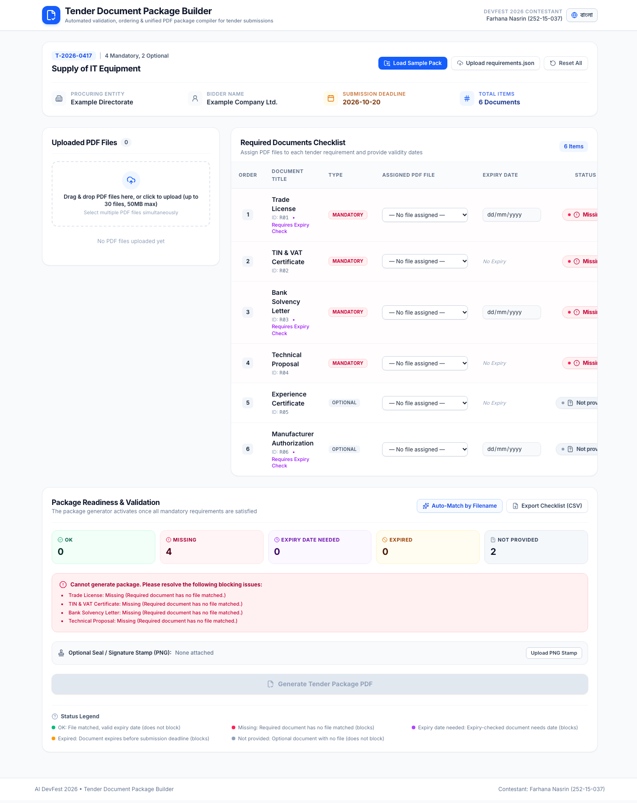
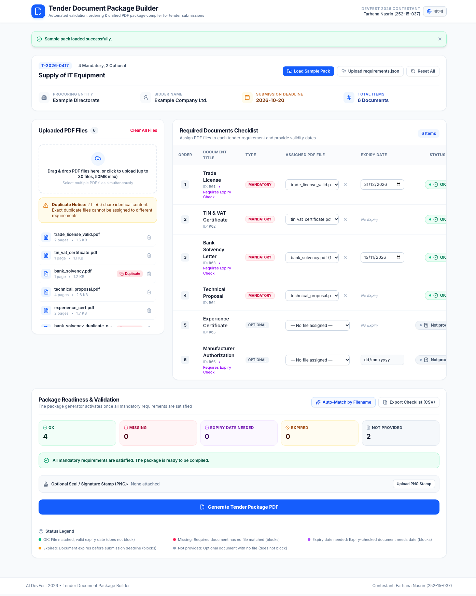
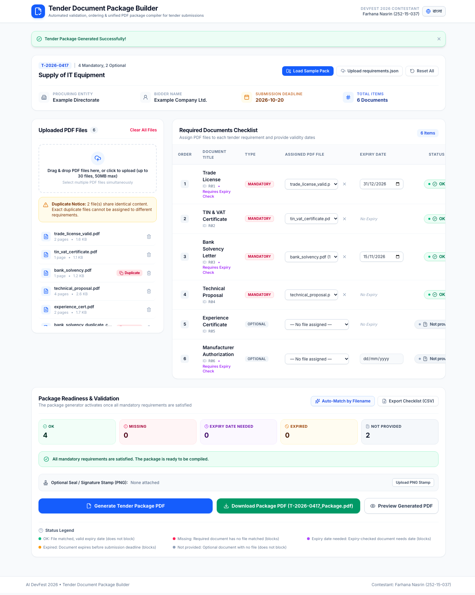
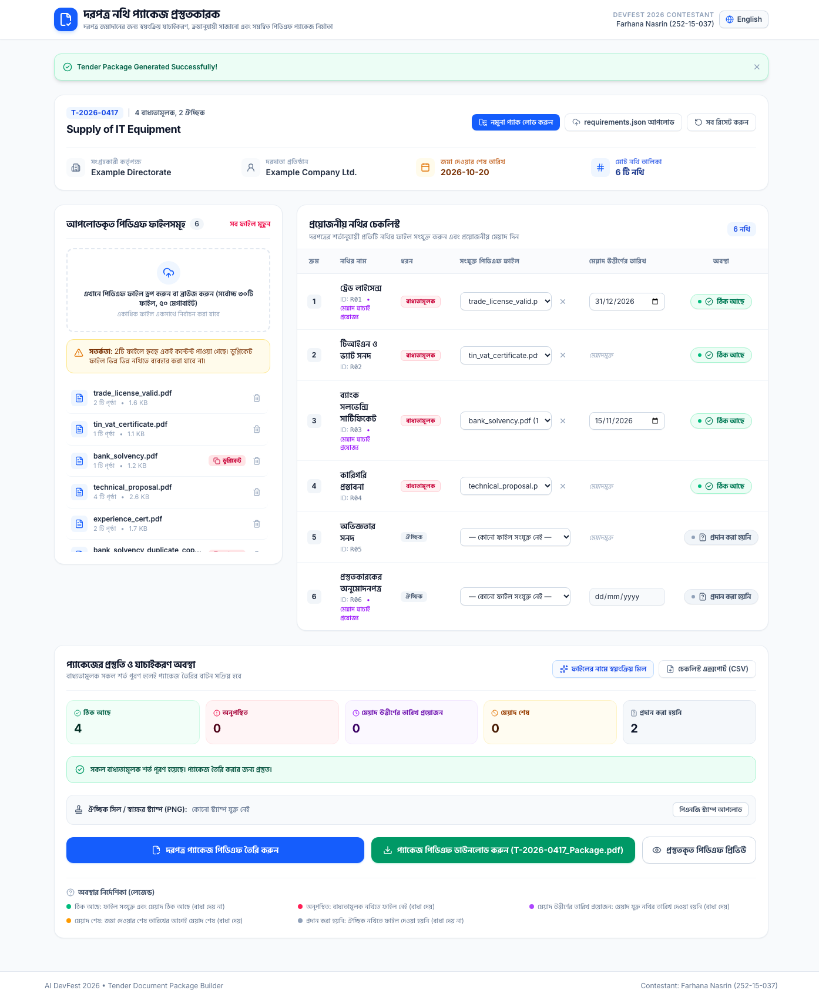
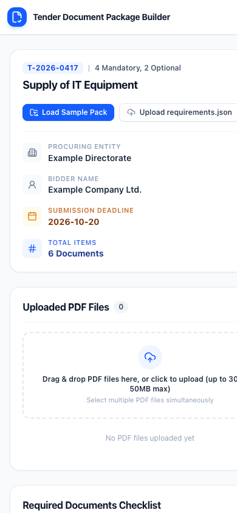

# Tender Document Package Builder

> Official Submission for **AI DevFest 2026 Vibe-Coding Contest**

---

## 1. Contestant Information
- **Name**: Farhana Nasrin
- **Registration Number**: 252-15-037
- **Contest**: AI DevFest 2026 Vibe-Coding Contest
- **Repository**: [https://github.com/Farhana52/devfest-252-15-037](https://github.com/Farhana52/devfest-252-15-037)
- **Live Deployment**: [https://farhana52.github.io/devfest-252-15-037/](https://farhana52.github.io/devfest-252-15-037/)

---

## 2. Live Application URL
The application is deployed on public HTTPS via GitHub Actions at:
👉 **[https://farhana52.github.io/devfest-252-15-037/](https://farhana52.github.io/devfest-252-15-037/)**

---

## 3. How to Run Locally

### Prerequisites
- Node.js (v18+ or v20+)
- npm (v9+)

### Installation and Execution
```bash
# 1. Clone the repository
git clone https://github.com/Farhana52/devfest-252-15-037.git
cd devfest-252-15-037

# 2. Install dependencies
npm install

# 3. Run automated logic & PDF generation tests
npm test

# 4. Start local development server
npm run dev

# 5. Build for production
npm run build

# 6. Preview production build
npm run preview
```

---

## 4. Main Features Completed

All mandatory tasks specified in the problem statement are fully implemented:

| Task ID | Requirement | Implementation Details |
|---|---|---|
| **4.1** | **Load the list** | Parses `requirements.json` (via upload or "Load Sample" button). Displays tender info (ID, title, procuring entity, bidder, deadline) and requirements sorted strictly by `order`. |
| **4.2** | **Upload files** | Batch upload for multiple PDF files with drag-and-drop. Accurately counts pages via `pdf-lib`. Rejects non-PDF files with clear bilingual error messages. Files can be individually or collectively removed. |
| **4.3** | **Match files** | Flexible 1-to-1 mapping interface. Assigning a file automatically clears it from other requirements. Instant unassign/clear option. |
| **4.4** | **Enter expiry dates** | Dedicated date picker enabled whenever `has_expiry = true` and a file is assigned. Validates against the tender submission deadline. |
| **4.5** | **Check everything** | Real-time status badge evaluation: `OK`, `Missing`, `Expiry date needed`, `Expired`, `Not provided`. Immediate reactive re-computation on every change. |
| **4.6** | **Find duplicates** | SHA-256 byte hashing identifies identical file contents regardless of filename. Displays prominent "Duplicate" warning badge. Blocks package generation if identical files are assigned to different requirements. |
| **4.7** | **Make the package** | "Generate Package" button is disabled whenever blocking issues exist, with an explicit list explaining why. When valid, compiles a unified PDF adhering strictly to Section 6. |
| **4.8** | **Download** | Downloads the compiled package as `<tender_id>_Package.pdf` (e.g. `T-2026-0417_Package.pdf`). |
| **4.9** | **Two languages** | Full bilingual support (English & বাংলা). Remembers language preference in `localStorage`. Document titles switch dynamically between `title_en` and `title_bn`. |

---

## 5. Bonus Tasks Completed

- ✅ **Bonus 1 — Table of Contents / Index**: Document page table included directly on the Cover Page displaying exact starting page numbers and page counts.
- ✅ **Bonus 2 — Digital Seal / Signature Stamp**: Allows uploading a PNG stamp/seal, embedding it cleanly on the official cover page.
- ✅ **Bonus 3 — Export Checklist as CSV**: Downloads an official verification checklist with Document ID, Title, Assigned File, Pages, Expiry Date, and Status.
- ✅ **Bonus 4 — Auto-Match Files**: Keyword heuristic matching algorithm automatically connects uploaded PDFs to requirements based on filename tokens.
- ✅ **Bonus 5 — In-App PDF Preview**: Built-in modal viewer to preview the generated PDF package directly in Google Chrome without leaving the application.
- ✅ **Bonus 6 — Resilient PDF Error Handling**: Corrupt or password-protected PDFs are trapped safely without application crashing, displaying actionable error messages.

---

## 6. Known Problems & Limitations

1. **Client-side PDF font limitations**: Standard PDF specification covers Helvetica/Times fonts for ASCII/English text. Bangla script rendering in raw PDF canvas requires embedded OpenType subsets; to preserve strict compliance with Section 6.1 ("Page 1 is a cover page, in English"), the cover page metadata is rendered cleanly in English.
2. **File Size Limit**: Designed for the contest limit of up to 30 files and 50MB total. Files exceeding this are safely rejected to prevent browser tab memory exhaustion.

---

## 7. AI Tools Used
- **Google DeepMind Antigravity IDE** powered by Gemini 3.8 Flash (High) for architecture planning, test design, automated testing via Chrome DevTools Protocol, and full-stack implementation.

---

## 8. Most Useful Prompt
> "Read AGENTS.md and follow it exactly. Complete the full contest task end to end. NAME: Farhana Nasrin REG: 252-15-037 PROBLEM_STATEMENT: /Users/farhananasrin/Documents/Vibe Coding/AIDevFest-ViveCoding_ProblemStatement.pdf /better-accessibility /better-colors /better-interface /better-layout /better-typography /better-ui /better-writing strictly follow this rule"

---

## 9. Verification Screenshots

All required verification screenshots are captured directly via headless Chrome:

| Screenshot | Description |
|---|---|
|  | **01-initial-state-en.png**: Initial baseline showing loaded requirements, "Missing" / "Not provided" status badges, and disabled generation button with blocking reasons. |
|  | **02-sample-loaded-with-duplicates.png**: Sample pack loaded with duplicate detection warning badge and real-time status updates. |
|  | **03-package-ready-and-generated.png**: All mandatory requirements satisfied ("OK"), generation button enabled, package generated with Download & Preview buttons. |
|  | **04-bangla-interface.png**: Full interface toggled to Bengali (বাংলা) with localized typography and document names. |
|  | **05-mobile-view.png**: Responsive view tested at 390px mobile viewport. |

---

## 10. License
Distributed under the MIT License. See `LICENSE` for details.
Copyright (c) 2026 Farhana Nasrin.
